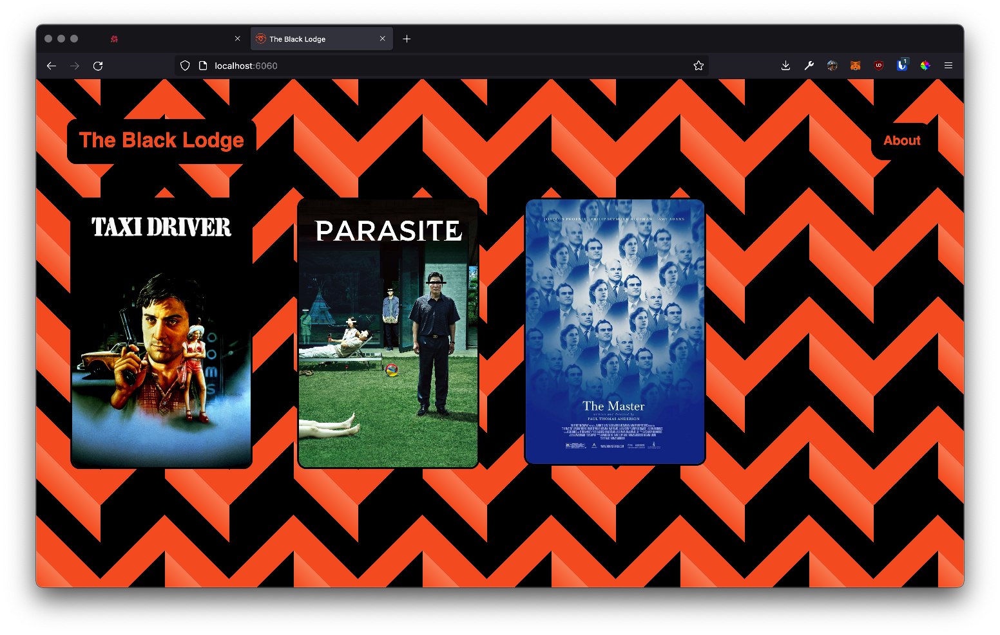

<h1 align="center">🎥 THE BLACK LODGE</h1>

>  
website built for Dan to curate and catalogue movie reviews and analysis
---
## `🍿` ABOUT
> 
> the website adopts themes from the famous show *Twin Peaks* and offers  the writer an opportunity to curate their movie analyses for themselves
---
### `⚜️` DESIGN + DEV
> designed by in sketch 
> coded in HTML/CSS/JS 
> CMS made in PHP 
created by [@majiinbju](https://github.com/majiinbju)
---
### `📄` CREDITS
> Built using [Kirby CMS](https://getkirby.com/) Plainkit
---
### `🪪` LICENSE
> The Black Lodge is [MIT licensed](https://github.com/majiinbju/joga/blob/main/LICENSE)
---
> [bajju.info](https://www.bajju.info) &nbsp;&middot;&nbsp;
> [@majiinbju](https://github.com/majiinbju) &nbsp;&middot;&nbsp;
> [linkedin](https://www.linkedin.com/in/vivek-bajaj-4a8035152/) &nbsp;&middot;&nbsp;
> [email](mailto:hi@vivekbajaj.design)
---
